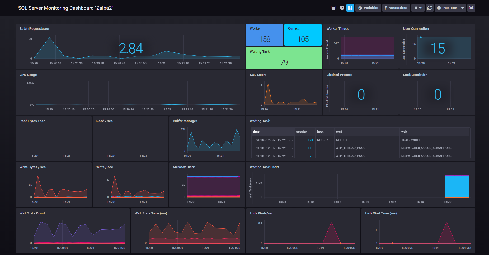
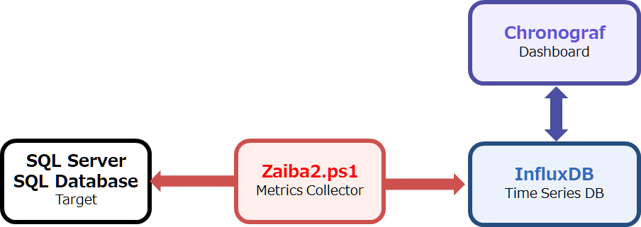
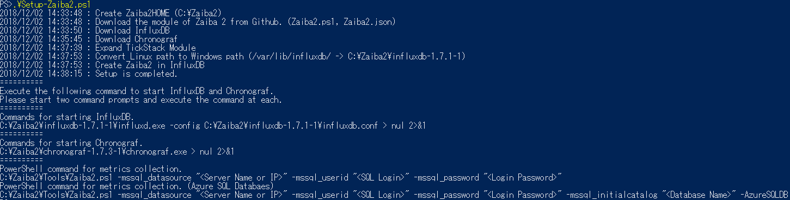
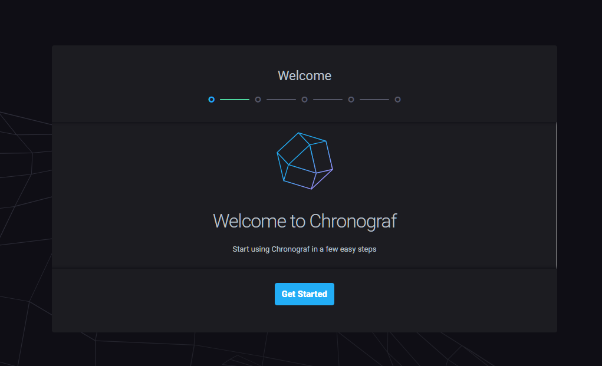
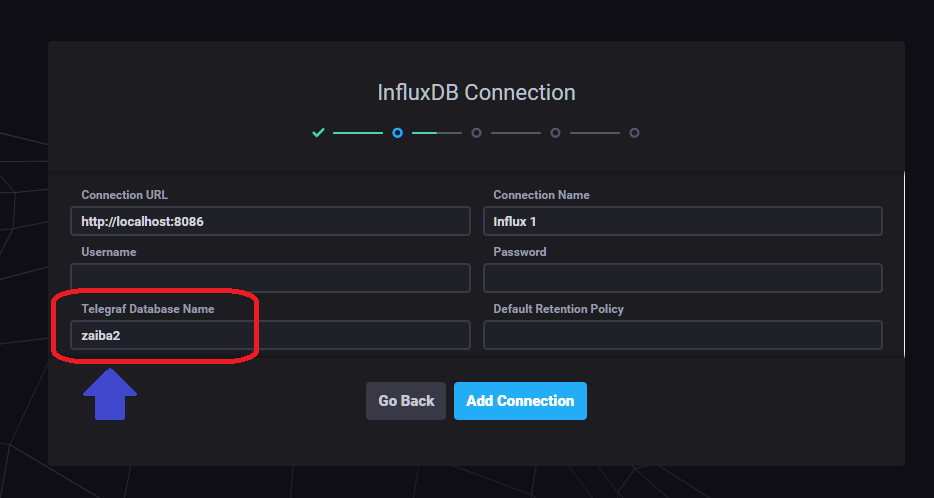
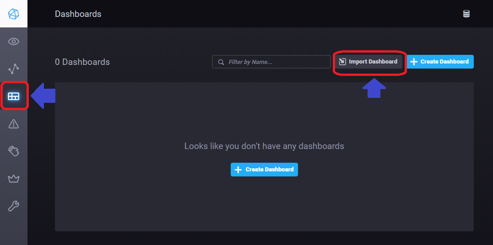
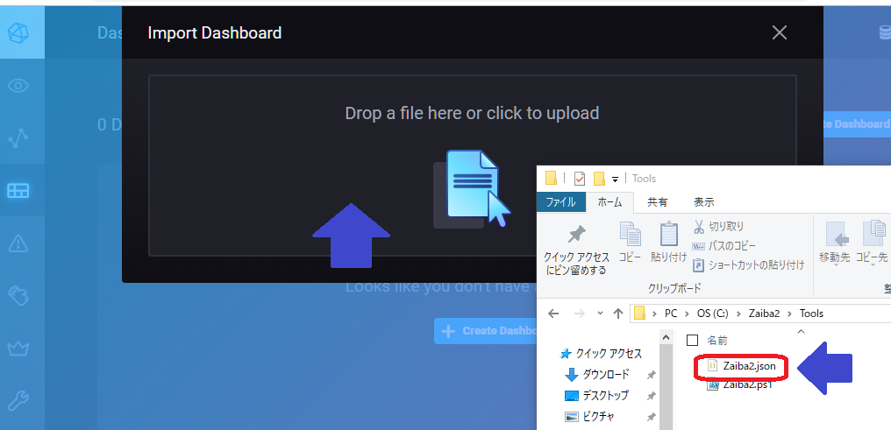
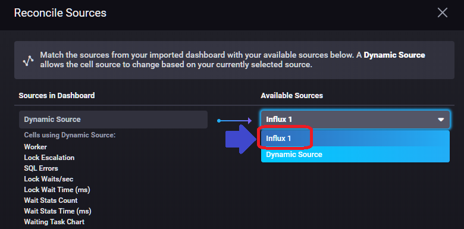
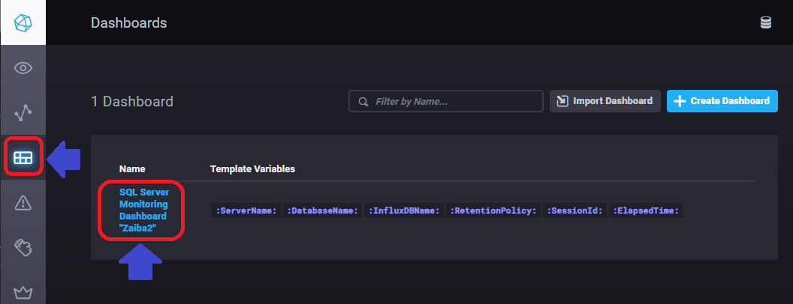
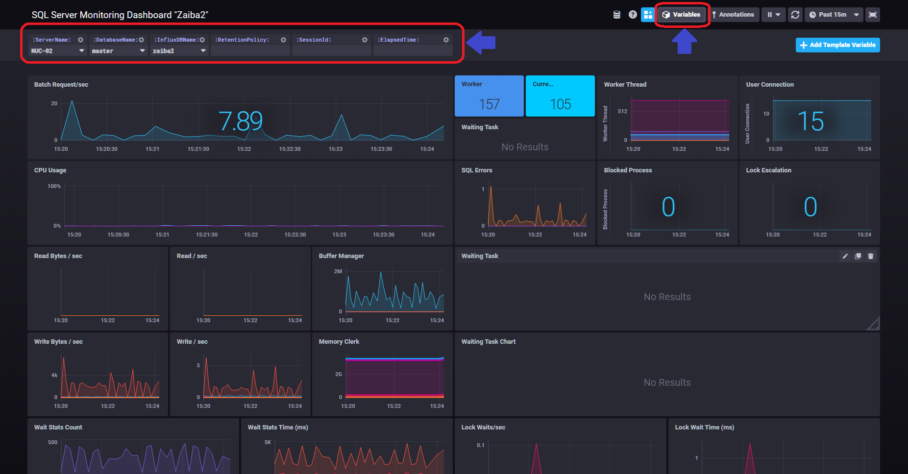

# SQL Server Simple Monitoring Tool "Zaiba2"
`Zaiba2` is a simple tool for obtaining SQL Server metrics in the Windows environment.  

Components of [TICK Stack](https://www.influxdata.com/time-series-platform/) and PowerShell scripts enable metrics collection and visualization.  
You can visualize information in SQL Server 2008 or later and SQL Database.


Get SQL Server metrics in `Zaiba2.ps1`, store them in `InfluxDB`, and visualize them in `Chronograf`.


## Setup
***
When running on Windows 10 / Windows Server 2016, setup can be executed by script.  
You can setup it by running [Setup/Setup-Zaiba2.ps1](./Setup/Setup-Zaiba2.ps1).  
(The file is stored in `C:\Zaiba2` by default)



If `Setup-Zaiba2.ps1` can not be executed normally, execute the InfluxDB and Chronograf setup with reference to the following information.  
[Running the TICK Stack on Windows](https://www.influxdata.com/blog/running-the-tick-stack-on-windows/)

## Let's Starting
***
First, start InfluxDB and Chronograf.
Start two command prompts and execute the following command.
```
C:\Zaiba2\influxdb-1.7.1-1\influxd.exe -config C:\Zaiba2\influxdb-1.7.1-1\influxdb.conf > nul 2>&1
```
```
C:\Zaiba2\chronograf-1.7.3-1\chronograf.exe > nul 2>&1
```
Chronograf can be accessed with http://localhost:8888.


Click `Get Started` to display the Add Connection screen.  
Specify `Zaiba2` for `Telegraf Database Name` and create a connection.


After adding connections, import the Zaiba2 dashboard.  
 

If you set up with a script, drag and drop `C:\Zaiba2\Tools\zaiba2.json`.  
If you set up manually, drag and drop the file of [./Chronograf/SQL Server Monitoring Dashboard _Zaiba2_.json](./Chronograf/SQL%20Server%20Monitoring%20Dashboard%20_Zaiba2_.json)  


If Reconcile Sources is displayed, please select `Influx 1`.  


Let's start getting metrics.  
In PowerShell, run `Zaiba2.ps1`.
```
C:\Zaiba2\Tools\Zaiba2.ps1 -mssql_datasource "<Server Name or IP>" -mssql_userid "<SQL Login>" -mssql_password "<Login Password>"
```
To obtain information on Azure SQL Database, execute the following command.
```
C:\Zaiba2\Tools\Zaiba2.ps1 -mssql_datasource "<Server Name or IP>" -mssql_userid "<SQL Login>" -mssql_password "<Login Password>" -mssql_initialcatalog "<Database Name>" -AzureSQLDB
```

Please open the dashboard with Chronograf when metrics collection starts normally.  


Variables can be changed by clicking on Variables.  
If you get metrics of more than one server, please change the variable.
